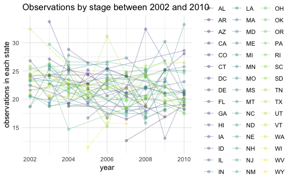
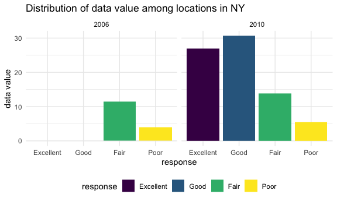

Homework 3
================
Lydia Parr
2019-10-20

## R Markdown

# Setup

First, I load relevant packages and set global preferences.

``` r
library(tidyverse)
library(p8105.datasets)
library(httr)
library(jsonlite)


knitr::opts_chunk$set(
  fig.width = 6,
  fig.asp = .6,
  out.width = "90%"
)

theme_set(theme_minimal() + theme(legend.position = "bottom"))

options(
  ggplot2.continuous.colour = "viridis",
  ggplot2.continuous.fill = "viridis"
)

scale_colour_discrete = scale_colour_viridis_d
scale_fill_discrete = scale_fill_viridis_d
```

## Problem 1

First, I load the Instacart data from the p8105.datasets using:

``` r
data("instacart")
```

The goal is to do some exploration of this dataset. To that end, write a
short description of the dataset, noting the size and structure of the
data, describing some key variables, and giving illstrative examples of
observations. Then, do or answer the following (commenting on the
results of each):

The dimensions of the instacart data set are 1384617, 15, with 20769255
observations, and the variables in this data set are: order\_id,
product\_id, add\_to\_cart\_order, reordered, user\_id, eval\_set,
order\_number, order\_dow, order\_hour\_of\_day,
days\_since\_prior\_order, product\_name, aisle\_id, department\_id,
aisle, department

Number of aisles (134) and those most ordered from (fresh vegetables,
fresh fruits, packages vagetables and fruits, yogurt, and cheese being
the five more popular) are found with the code below, and I also make a
plot that shows the number of items ordered in each aisle, limiting this
to aisles with more than 10000 items ordered, derived from the products
ordered per aise and arranged by magnitude.

``` r
n_aisles = 
  instacart %>%
  count(aisle) %>%
  arrange(desc(n))

head(n_aisles, 10)
```

    ## # A tibble: 10 x 2
    ##    aisle                              n
    ##    <chr>                          <int>
    ##  1 fresh vegetables              150609
    ##  2 fresh fruits                  150473
    ##  3 packaged vegetables fruits     78493
    ##  4 yogurt                         55240
    ##  5 packaged cheese                41699
    ##  6 water seltzer sparkling water  36617
    ##  7 milk                           32644
    ##  8 chips pretzels                 31269
    ##  9 soy lactosefree                26240
    ## 10 bread                          23635

``` r
nrow(n_aisles)
```

    ## [1] 134

``` r
insta_plot1 = n_aisles %>%  
  filter(
   n > 10000)  %>%  
  mutate(
    aisle = factor(aisle),
    aisle = fct_reorder(aisle, n)
  ) %>%  
  ggplot(aes(x = aisle, y = n)) +
           geom_bar(stat = "identity") +
           labs(
             title = "Number of items ordered per aisle",
             x = "aisle",
             y = "number of orders") +
  theme(axis.text.x = element_text(size = 8, angle = 65, hjust = 1))
         
  insta_plot1
```


``` r
  ggsave("instacart_plot1_aisles.pdf", insta_plot1, width = 8, height = 5)
```

The top few aisles are the most popular by far, with fresh vegetables,
fresh fruits, packaged vegetables fruits, and yogurt having the highest
number of orders.

Next, I make a table showing the three most popular items in each of the
aisles “baking ingredients,” “dog food care,” and “packaged vegetables
fruits,” and I include the number of times each item is ordered in my
table under the `n` variable.

``` r
insta_table = 
  instacart %>% 
  filter(aisle == c("baking ingredients", "dog food care", "packaged vegetables fruits")) %>% 
  group_by(aisle) %>%  
  count(product_name) %>% 
  mutate(rank = min_rank(desc(n)),
         product_name = tolower(product_name)) %>% 
  filter(rank <= 3)  %>% 
  arrange(aisle, rank)
knitr::kable(insta_table, caption = "Most popular items in three aisles")
```

| aisle                      | product\_name                                   |    n | rank |
|:---------------------------|:------------------------------------------------|-----:|-----:|
| baking ingredients         | light brown sugar                               |  157 |    1 |
| baking ingredients         | pure baking soda                                |  140 |    2 |
| baking ingredients         | organic vanilla extract                         |  122 |    3 |
| dog food care              | organix grain free chicken & vegetable dog food |   14 |    1 |
| dog food care              | organix chicken & brown rice recipe             |   13 |    2 |
| dog food care              | original dry dog                                |    9 |    3 |
| packaged vegetables fruits | organic baby spinach                            | 3324 |    1 |
| packaged vegetables fruits | organic raspberries                             | 1920 |    2 |
| packaged vegetables fruits | organic blueberries                             | 1692 |    3 |

Most popular items in three aisles

Next, I make a table showing the mean hour of the day at which Pink Lady
Apples and Coffee Ice Cream are ordered on each day of the week,
formatting for human readers. \#\# mutate(product\_name =
tolower(product\_name), \#\# order\_dow = recode(order\_dow, 0 =
“sunday”, 1 = “monday”, 2 = \#\# “tuesday”, 3 = “wednesday”, 4 =
“thursday”, \#\# 5 = “friday”, 6 = “saturday”)) %&gt;%

## mutate(order\_dow = fct\_reorder(order\_dow, “sunday”, “monday”, “tuesday”, “wednesday”,

## “thursday”, “friday”, “saturday”)) %&gt;%

``` r
insta_table2 = 
  instacart %>% 
  mutate(product_name = tolower(product_name),
         order_dow = recode(order_dow, "0" = "sunday", "1" = "monday", 
                            "2" = "tuesday", "3" = "wednesday", "4" = "thursday", 
                            "5" = "friday", "6" = "saturday")) %>%
  filter(product_name == c("pink lady apples", "coffee ice cream")) %>% 
  group_by(product_name, order_dow) %>%  
  summarize(mean_hour = mean(order_hour_of_day)) %>% 
  pivot_wider(names_from = order_dow, 
              values_from = mean_hour) 
```

    ## Warning in product_name == c("pink lady apples", "coffee ice cream"): longer
    ## object length is not a multiple of shorter object length

``` r
knitr::kable(insta_table2, digits = 3,
             caption = "Mean hour Pink Lady Apples and Coffee Ice Cream are ordered on each day")
```

| product\_name    | friday | monday | saturday | sunday | thursday | tuesday | wednesday |
|:-----------------|-------:|-------:|---------:|-------:|---------:|--------:|----------:|
| coffee ice cream | 10.333 | 15.000 |   12.353 | 13.222 |   15.167 |  15.333 |    15.400 |
| pink lady apples | 13.870 | 11.679 |   11.556 | 12.250 |   11.909 |  12.000 |    13.938 |

Mean hour Pink Lady Apples and Coffee Ice Cream are ordered on each day

## Problem 2

This problem uses the BRFSS data, loaded from the `p8105.datasets`
package.

I clean by:

-   formatting the data to use appropriate variable names
-   focusing on the “Overall Health” topic
-   include only responses from “Excellent” to “Poor”
-   organize responses as a factor taking levels ordered from “Poor” to
    “Excellent”

``` r
data("brfss_smart2010")

brfss = 
  brfss_smart2010 %>% 
  janitor::clean_names() %>%
  filter(topic == "Overall Health", 
         response == c("Excellent", "Very Good", "Good", "Fair", "Poor")) %>%
  mutate(response = factor(response, levels = c("Excellent", "Very Good", "Good", "Fair", "Poor") )) %>%
  arrange(response) %>% 
  rename(state = locationabbr) %>% 
  select(-c(data_value_footnote, data_value_footnote_symbol, location_id)) %>% 
  drop_na()
```

    ## Warning in response == c("Excellent", "Very Good", "Good", "Fair", "Poor"):
    ## longer object length is not a multiple of shorter object length

Using this dataset, do or answer the following (commenting on the
results of each):

In 2002, which states were observed at 7 or more locations? What about
in 2010?

6 in 2002 13 2010

``` r
brfss_2002 = 
  brfss %>% 
  filter(year == "2002") %>%
  group_by(state) %>%
  count(state) %>%
  filter(n >= 7)
knitr::kable(brfss_2002,
             caption = "States observed at 7 or more locations, 2002")
```

| state |   n |
|:------|----:|
| GA    |   8 |
| MA    |   9 |
| ME    |   8 |
| NJ    |   8 |
| OH    |   8 |
| PA    |  15 |

States observed at 7 or more locations, 2002

``` r
brfss_2010 = 
  brfss %>% 
  filter(year == "2010") %>%
  group_by(state) %>%
  count(state) %>%
  filter(n >= 7)
knitr::kable(brfss_2010,
             caption = "States observed at 7 or more locations, 2010")
```

| state |   n |
|:------|----:|
| CA    |  13 |
| CO    |   8 |
| FL    |  31 |
| ID    |   8 |
| MA    |   8 |
| MD    |  12 |
| ME    |   8 |
| NY    |  12 |
| OH    |   7 |
| SC    |   7 |
| TN    |   8 |
| TX    |  14 |
| UT    |   7 |

States observed at 7 or more locations, 2010

Next, I construct a dataset that is limited to Excellent responses,
containing, year, state, and a variable that averages the data\_value
across locations within a state.

I then make a “spaghetti” plot of this average value over time within a
state.

``` r
brfss_excellent = 
  brfss %>%
  filter(response == "Excellent") %>%
  group_by(state, year) %>%
  summarize(mean_dv = mean(data_value, na.rm = TRUE))

brfss_excellent_spaghetti = 
  ggplot(brfss_excellent, aes(x = year,
                              y = mean_dv,
                              color = state)) +
  geom_line(alpha = 0.3, aes(group = state, color = state)) +
  geom_point(alpha = 0.3, aes(group = state, color = state)) +
  labs(x = "year", 
       y = "observations in each state", 
       title = "Observations by stage between 2002 and 2010") +
  theme(legend.position = "right")
  
brfss_excellent_spaghetti
```



``` r
ggsave("brfss_plot1_spaghetti.pdf", brfss_excellent_spaghetti, width = 8, height = 5)
```

There is no general trend for this data, but there are generally more
than ten observations for each state, with no single state standing
apart from the data as an outlier.

I now make a two-panel bar graph for the years 2006 and 2010 showing the
distribution of the variable data\_value for responses (“Poor” to
“Excellent”) among locations in NY State.

``` r
brfss_final = 
  brfss %>%
  filter((year == "2006" | year == "2010"),
        state == "NY")  %>%
  group_by(data_value) %>%
  ggplot(aes(x = response,
             y = data_value, 
             fill = response)) +
  geom_col(position = "dodge") +
  facet_grid(. ~ year) +
  labs(x = "response",
       y = "data value",
       title = "Distribution of data value among locations in NY")

brfss_final
```



## Problem 3

This problem uses five weeks of accelerometer data collected on a 63
year-old male with BMI 25, who was admitted to the Advanced Cardiac Care
Center of Columbia University Medical Center and diagnosed with
congestive heart failure (CHF). The data can be downloaded here. In this
spreadsheet, variables activity.\* are the activity counts for each
minute of a 24-hour day starting at midnight.

First, I load, tidy, and otherwise wrangle the data, using
`janitor::clean_names` to standardize variable names, adding a weekday
vs weekend variable, and encoding the data with reasonable variable
classes.

``` r
accel = read_csv(file = "./hw3_data_files/accel_data.csv") %>%
  janitor::clean_names() 
```

    ## 
    ## ── Column specification ────────────────────────────────────────────────────────
    ## cols(
    ##   .default = col_double(),
    ##   day = col_character()
    ## )
    ## ℹ Use `spec()` for the full column specifications.

``` r
accel_cleaned = 
  accel %>% 
  pivot_longer(
    cols = activity_1:activity_1440,
    names_to = "activity_number",
    values_to = "activity_counts",
    names_prefix = "activity.") %>%
  mutate(
    weekend = (day == "Saturday" | day == "Sunday"))
```

The dimensions of the new data set are 50400, 6. The varriables are
week, day\_id, day, activity\_number, activity\_counts, weekend.

Traditional analyses of accelerometer data focus on the total activity
over the day. Using your tidied dataset, aggregate accross minutes to
create a total activity variable for each day, and create a table
showing these totals. Are any trends apparent?

Accelerometer data allows the inspection activity over the course of the
day. Make a single-panel plot that shows the 24-hour activity time
courses for each day and use color to indicate day of the week. Describe
in words any patterns or conclusions you can make based on this graph.
