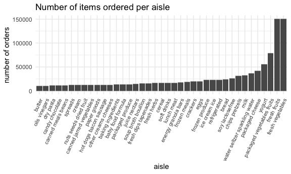

p8105\_hw3\_lcp2148
================

## R Markdown

# Setup

I will load relevant packages here :3

``` r
library(tidyverse)
```

    ## ── Attaching packages ─────────────────────────────────────── tidyverse 1.3.1 ──

    ## ✓ ggplot2 3.3.4     ✓ purrr   0.3.4
    ## ✓ tibble  3.1.2     ✓ dplyr   1.0.7
    ## ✓ tidyr   1.1.3     ✓ stringr 1.4.0
    ## ✓ readr   1.4.0     ✓ forcats 0.5.1

    ## ── Conflicts ────────────────────────────────────────── tidyverse_conflicts() ──
    ## x dplyr::filter() masks stats::filter()
    ## x dplyr::lag()    masks stats::lag()

``` r
library(p8105.datasets)
library(httr)
library(jsonlite)
```

    ## 
    ## Attaching package: 'jsonlite'

    ## The following object is masked from 'package:purrr':
    ## 
    ##     flatten

``` r
library(dplyr)
library(patchwork)
library(ggplot2)
library(tidyr)
library(ggridges)

library(tidyverse)

knitr::opts_chunk$set(
  fig.width = 6,
  fig.asp = .6,
  out.width = "90%"
)

theme_set(theme_minimal() + theme(legend.position = "bottom"))

options(
  ggplot2.continuous.colour = "viridis",
  ggplot2.continuous.fill = "viridis"
)

scale_colour_discrete = scale_colour_viridis_d
scale_fill_discrete = scale_fill_viridis_d
```

## Problem 1

This problem uses the Instacart data. DO NOT include this dataset in
your local data directory; instead, load the data from the
p8105.datasets using:

``` r
data("instacart")
```

The goal is to do some exploration of this dataset. To that end, write a
short description of the dataset, noting the size and structure of the
data, describing some key variables, and giving illstrative examples of
observations. Then, do or answer the following (commenting on the
results of each):

The dimensions of the instacart data set are 1384617, 15, with 20769255
observations, and the variables in this data set are: order\_id,
product\_id, add\_to\_cart\_order, reordered, user\_id, eval\_set,
order\_number, order\_dow, order\_hour\_of\_day,
days\_since\_prior\_order, product\_name, aisle\_id, department\_id,
aisle, department

Number of aisles (134) and those most ordered from are found with the
code below:

I also make a plot that shows the number of items ordered in each aisle,
limiting this to aisles with more than 10000 items ordered. Arrange
aisles sensibly, and organize your plot so others can read it.
oder\_number is derived from products per aisle scatter ordered by
magniture

``` r
n_aisles = 
  instacart %>%
  count(aisle) %>%
  arrange(desc(n))

head(n_aisles, 10)
```

    ## # A tibble: 10 x 2
    ##    aisle                              n
    ##    <chr>                          <int>
    ##  1 fresh vegetables              150609
    ##  2 fresh fruits                  150473
    ##  3 packaged vegetables fruits     78493
    ##  4 yogurt                         55240
    ##  5 packaged cheese                41699
    ##  6 water seltzer sparkling water  36617
    ##  7 milk                           32644
    ##  8 chips pretzels                 31269
    ##  9 soy lactosefree                26240
    ## 10 bread                          23635

``` r
nrow(n_aisles)
```

    ## [1] 134

``` r
insta_plot1 = n_aisles %>%  
  filter(
   n > 10000)  %>%  
  mutate(
    aisle = factor(aisle),
    aisle = fct_reorder(aisle, n)
  ) %>%  
  ggplot(aes(x = aisle, y = n)) +
           geom_bar(stat = "identity") +
           labs(
             title = "Number of items ordered per aisle",
             x = "aisle",
             y = "number of orders") +
  theme(axis.text.x = element_text(size = 8, angle = 65, hjust = 1))
         
  insta_plot1
```



``` r
  ggsave("instacart_plot1_aisles.pdf", insta_plot1, width = 8, height = 5)
```

Make a table showing the three most popular items in each of the aisles
“baking ingredients”, “dog food care”, and “packaged vegetables fruits”.
Include the number of times each item is ordered in your table.

``` r
insta_table = 
  instacart %>% 
  filter(aisle == c("baking ingredients", "dog food care", "packaged vegetables fruits")) %>% 
  group_by(aisle) %>%  
  count(product_name) %>% 
  mutate(product_pop = min_rank(desc(n)),
         product_name = tolower(product_name)) %>% 
  filter(product_pop <= 3)  %>% 
  arrange(aisle, product_pop)
knitr::kable(insta_table, caption = "Most popular items in three aisles")
```

| aisle                      | product\_name                                   |    n | product\_pop |
|:---------------------------|:------------------------------------------------|-----:|-------------:|
| baking ingredients         | light brown sugar                               |  157 |            1 |
| baking ingredients         | pure baking soda                                |  140 |            2 |
| baking ingredients         | organic vanilla extract                         |  122 |            3 |
| dog food care              | organix grain free chicken & vegetable dog food |   14 |            1 |
| dog food care              | organix chicken & brown rice recipe             |   13 |            2 |
| dog food care              | original dry dog                                |    9 |            3 |
| packaged vegetables fruits | organic baby spinach                            | 3324 |            1 |
| packaged vegetables fruits | organic raspberries                             | 1920 |            2 |
| packaged vegetables fruits | organic blueberries                             | 1692 |            3 |

Most popular items in three aisles

Make a table showing the mean hour of the day at which Pink Lady Apples
and Coffee Ice Cream are ordered on each day of the week; format this
table for human readers (i.e. produce a 2 x 7 table). \#\#
mutate(product\_name = tolower(product\_name), \#\# order\_dow =
recode(order\_dow, 0 = “sunday”, 1 = “monday”, 2 = \#\# “tuesday”, 3 =
“wednesday”, 4 = “thursday”, \#\# 5 = “friday”, 6 = “saturday”)) %&gt;%

## mutate(order\_dow = fct\_reorder(order\_dow, “sunday”, “monday”, “tuesday”, “wednesday”,

## “thursday”, “friday”, “saturday”)) %&gt;%

``` r
insta_table2 = 
  instacart %>% 
  mutate(product_name = tolower(product_name),
         order_dow = recode(order_dow, 
                            "0" = "sunday", "1" = "monday", "2" = "tuesday",
                            "3" = "wednesday", "4" = "thursday", "5" = "friday", 
                            "6" = "saturday")) %>% 
  filter(product_name == c("pink lady apples", "coffee ice cream")) %>% 
  group_by(product_name, order_dow) %>%  
  summarize(mean_hour = mean(order_hour_of_day)) %>% 
  pivot_wider(names_from = order_dow, 
              values_from = mean_hour)
```

    ## Warning in product_name == c("pink lady apples", "coffee ice cream"): longer
    ## object length is not a multiple of shorter object length

    ## `summarise()` has grouped output by 'product_name'. You can override using the `.groups` argument.

``` r
knitr::kable(insta_table2, digits = 3,
             caption = "Mean hour Pink Lady Apples and Coffee Ice Cream are ordered on each day")
```

| product\_name    | friday | monday | saturday | sunday | thursday | tuesday | wednesday |
|:-----------------|-------:|-------:|---------:|-------:|---------:|--------:|----------:|
| coffee ice cream | 10.333 | 15.000 |   12.353 | 13.222 |   15.167 |  15.333 |    15.400 |
| pink lady apples | 13.870 | 11.679 |   11.556 | 12.250 |   11.909 |  12.000 |    13.938 |

Mean hour Pink Lady Apples and Coffee Ice Cream are ordered on each day

## Problem 2

This problem uses the BRFSS data, loaded from the `p8105.datasets`
package. I will clean :

-   format the data to use appropriate variable names;
-   focus on the “Overall Health” topic
-   include only responses from “Excellent” to “Poor”
-   organize responses as a factor taking levels ordered from “Poor” to
    “Excellent”

``` r
data("brfss_smart2010")

brfss = 
  brfss_smart2010 %>% 
  janitor::clean_names() %>%
  filter(topic == "Overall Health", 
         response == c("Excellent", "Very Good", "Good", "Fair", "Poor")) %>%
  mutate(response = factor(response, levels = c("Excellent", "Very Good", "Good", 
                                                "Fair", "Poor") )) %>%
  separate(locationdesc, c("state", "location", "rest")) %>%
  unite(location, c("location", "rest")) %>%
  arrange(response)
```

    ## Warning in response == c("Excellent", "Very Good", "Good", "Fair", "Poor"):
    ## longer object length is not a multiple of shorter object length

    ## Warning: Expected 3 pieces. Additional pieces discarded in 211 rows [12, 17, 18,
    ## 19, 20, 57, 58, 59, 60, 61, 62, 63, 64, 94, 95, 96, 97, 98, 147, 148, ...].

Using this dataset, do or answer the following (commenting on the
results of each):

In 2002, which states were observed at 7 or more locations? What about
in 2010? Construct a dataset that is limited to Excellent responses, and
contains, year, state, and a variable that averages the data\_value
across locations within a state. Make a “spaghetti” plot of this average
value over time within a state (that is, make a plot showing a line for
each state across years – the geom\_line geometry and group aesthetic
will help). Make a two-panel plot showing, for the years 2006, and 2010,
distribution of data\_value for responses (“Poor” to “Excellent”) among
locations in NY State.

## Problem 3

Accelerometers have become an appealing alternative to self-report
techniques for studying physical activity in observational studies and
clinical trials, largely because of their relative objectivity. During
observation periods, the devices measure “activity counts” in a short
period; one-minute intervals are common. Because accelerometers can be
worn comfortably and unobtrusively, they produce around-the-clock
observations.

This problem uses five weeks of accelerometer data collected on a 63
year-old male with BMI 25, who was admitted to the Advanced Cardiac Care
Center of Columbia University Medical Center and diagnosed with
congestive heart failure (CHF). The data can be downloaded here. In this
spreadsheet, variables activity.\* are the activity counts for each
minute of a 24-hour day starting at midnight.

Load, tidy, and otherwise wrangle the data. Your final dataset should
include all originally observed variables and values; have useful
variable names; include a weekday vs weekend variable; and encode data
with reasonable variable classes. Describe the resulting dataset
(e.g. what variables exist, how many observations, etc).

``` r
accel = read_csv(file = "./hw3_data_files/accel_data.csv") %>%
  janitor::clean_names() 
```

    ## 
    ## ── Column specification ────────────────────────────────────────────────────────
    ## cols(
    ##   .default = col_double(),
    ##   day = col_character()
    ## )
    ## ℹ Use `spec()` for the full column specifications.

Traditional analyses of accelerometer data focus on the total activity
over the day. Using your tidied dataset, aggregate accross minutes to
create a total activity variable for each day, and create a table
showing these totals. Are any trends apparent? Accelerometer data allows
the inspection activity over the course of the day. Make a single-panel
plot that shows the 24-hour activity time courses for each day and use
color to indicate day of the week. Describe in words any patterns or
conclusions you can make based on this graph.
