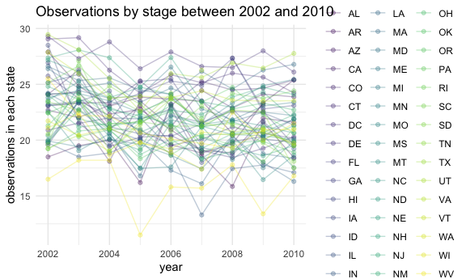
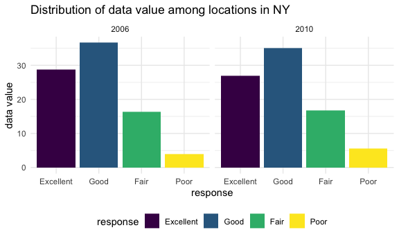
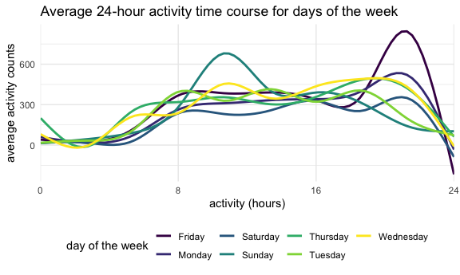

Homework 3
================
Lydia Parr
2019-10-20

## Setup

First, I load relevant packages and set global preferences.

``` r
library(tidyverse)
library(p8105.datasets)
library(httr)
library(jsonlite)


knitr::opts_chunk$set(
  fig.width = 6,
  fig.asp = .6,
  out.width = "90%"
)

theme_set(theme_minimal() + theme(legend.position = "bottom"))

options(
  ggplot2.continuous.colour = "viridis",
  ggplot2.continuous.fill = "viridis"
)

scale_colour_discrete = scale_colour_viridis_d
scale_fill_discrete = scale_fill_viridis_d
```

## Problem 1

I load the Instacart data from the p8105.datasets using:

``` r
data("instacart")
```

The dimensions of the instacart data set are 1384617, 15, with 20769255
observations, and the variables in this data set are: order\_id,
product\_id, add\_to\_cart\_order, reordered, user\_id, eval\_set,
order\_number, order\_dow, order\_hour\_of\_day,
days\_since\_prior\_order, product\_name, aisle\_id, department\_id,
aisle, department

Number of aisles (134) and those most ordered from (fresh vegetables,
fresh fruits, packages vegetables and fruits, yogurt, and cheese being
the five most popular) are found with the code below, and I also make a
plot that shows the number of items ordered in each aisle, limiting this
to aisles with more than 10000 items ordered, derived from the products
ordered per aise and arranged by magnitude.

``` r
n_aisles = 
  instacart %>%
  count(aisle) %>%
  arrange(desc(n))

head(n_aisles, 10)
```

    ## # A tibble: 10 x 2
    ##    aisle                              n
    ##    <chr>                          <int>
    ##  1 fresh vegetables              150609
    ##  2 fresh fruits                  150473
    ##  3 packaged vegetables fruits     78493
    ##  4 yogurt                         55240
    ##  5 packaged cheese                41699
    ##  6 water seltzer sparkling water  36617
    ##  7 milk                           32644
    ##  8 chips pretzels                 31269
    ##  9 soy lactosefree                26240
    ## 10 bread                          23635

``` r
nrow(n_aisles)
```

    ## [1] 134

``` r
insta_plot1 = n_aisles %>%  
  filter(
   n > 10000)  %>%  
  mutate(
    aisle = factor(aisle),
    aisle = fct_reorder(aisle, n)
  ) %>%  
  ggplot(aes(x = aisle, y = n)) +
           geom_bar(stat = "identity") +
           labs(
             title = "Number of items ordered per aisle",
             x = "aisle",
             y = "number of orders") +
  theme(axis.text.x = element_text(size = 8, angle = 65, hjust = 1))
         
  insta_plot1
```


``` r
  ggsave("instacart_plot1_aisles.pdf", insta_plot1, width = 8, height = 5)
```

The top few aisles are the most popular by far, with fresh vegetables,
fresh fruits, packaged vegetables fruits, and yogurt again being shown
to have the highest number of orders.

Next, I make a table showing the three most popular items in each of the
aisles “baking ingredients,” “dog food care,” and “packaged vegetables
fruits,” and I include the number of times each item is ordered in my
table under the `n` variable.

``` r
insta_table = 
  instacart %>% 
  filter(aisle == c("baking ingredients", "dog food care", "packaged vegetables fruits")) %>% 
  group_by(aisle) %>%  
  count(product_name) %>% 
  mutate(rank = min_rank(desc(n)),
         product_name = tolower(product_name)) %>% 
  filter(rank <= 3)  %>% 
  arrange(aisle, rank)
knitr::kable(insta_table, caption = "*Most popular items in three aisles*")
```

| aisle                      | product\_name                                   |    n | rank |
|:---------------------------|:------------------------------------------------|-----:|-----:|
| baking ingredients         | light brown sugar                               |  157 |    1 |
| baking ingredients         | pure baking soda                                |  140 |    2 |
| baking ingredients         | organic vanilla extract                         |  122 |    3 |
| dog food care              | organix grain free chicken & vegetable dog food |   14 |    1 |
| dog food care              | organix chicken & brown rice recipe             |   13 |    2 |
| dog food care              | original dry dog                                |    9 |    3 |
| packaged vegetables fruits | organic baby spinach                            | 3324 |    1 |
| packaged vegetables fruits | organic raspberries                             | 1920 |    2 |
| packaged vegetables fruits | organic blueberries                             | 1692 |    3 |

*Most popular items in three aisles*

Next, I make a table showing the mean hour of the day at which Pink Lady
Apples and Coffee Ice Cream are ordered on each day of the week, using
`pivot_wider` to make it a 2x7 table.

``` r
insta_table2 = 
  instacart %>% 
  mutate(product_name = tolower(product_name),
         order_dow = recode(order_dow, "0" = "sunday", "1" = "monday", "2" = "tuesday", "3" = "wednesday", "4" = "thursday", "5" = "friday", "6" = "saturday")) %>%
  filter(product_name == c("pink lady apples", "coffee ice cream")) %>% 
  group_by(product_name, order_dow) %>%  
  summarize(mean_hour = mean(order_hour_of_day)) %>% 
  pivot_wider(names_from = order_dow, 
              values_from = mean_hour) 
```

    ## Warning in product_name == c("pink lady apples", "coffee ice cream"): longer
    ## object length is not a multiple of shorter object length

``` r
knitr::kable(insta_table2, digits = 3,
             caption = "*Mean hour Pink Lady Apples and Coffee Ice Cream are ordered on each day*")
```

| product\_name    | friday | monday | saturday | sunday | thursday | tuesday | wednesday |
|:-----------------|-------:|-------:|---------:|-------:|---------:|--------:|----------:|
| coffee ice cream | 10.333 | 15.000 |   12.353 | 13.222 |   15.167 |  15.333 |    15.400 |
| pink lady apples | 13.870 | 11.679 |   11.556 | 12.250 |   11.909 |  12.000 |    13.938 |

*Mean hour Pink Lady Apples and Coffee Ice Cream are ordered on each
day*

## Problem 2

This problem uses the BRFSS data, loaded from the `p8105.datasets`
package.

I clean by:

-   formatting the data to use appropriate variable names
-   focusing on the “Overall Health” topic
-   include only responses from “Excellent” to “Poor”
-   organize responses as a factor taking levels ordered from “Poor” to
    “Excellent”

``` r
data("brfss_smart2010")

brfss = 
  brfss_smart2010 %>% 
  janitor::clean_names() %>%
  filter(topic == "Overall Health", 
         response %in% c("Excellent", "Very Good", "Good", "Fair", "Poor")) %>%
  mutate(response = factor(response, levels = c("Excellent", "Very Good", "Good", "Fair", "Poor") )) %>%
  arrange(response) %>% 
  rename(state = locationabbr) %>% 
  select(-c(data_value_footnote, data_value_footnote_symbol, location_id)) %>% 
  drop_na()
```

The following code tells us which states were observed at 7 or more
locations in 2002, then 2010:

``` r
brfss_2002 = 
  brfss %>% 
  filter(year == "2002") %>%
  group_by(state) %>%
  count(state) %>%
  filter(n >= 7)
knitr::kable(brfss_2002,
             caption = "*States observed at 7 or more locations, 2002*")
```

| state |   n |
|:------|----:|
| AZ    |   8 |
| CO    |  16 |
| CT    |  28 |
| DE    |  12 |
| FL    |  28 |
| GA    |  12 |
| HI    |  16 |
| ID    |   8 |
| IL    |  12 |
| IN    |   8 |
| KS    |  12 |
| LA    |  12 |
| MA    |  32 |
| MD    |  24 |
| ME    |   8 |
| MI    |  16 |
| MN    |  16 |
| MO    |   8 |
| NC    |  28 |
| NE    |  12 |
| NH    |  20 |
| NJ    |  24 |
| NV    |   8 |
| NY    |  20 |
| OH    |  16 |
| OK    |  12 |
| OR    |  12 |
| PA    |  40 |
| RI    |  16 |
| SC    |  12 |
| SD    |   8 |
| TN    |   8 |
| TX    |   8 |
| UT    |  20 |
| VT    |  12 |
| WA    |  16 |

*States observed at 7 or more locations, 2002*

``` r
brfss_2010 = 
  brfss %>% 
  filter(year == "2010") %>%
  group_by(state) %>%
  count(state) %>%
  filter(n >= 7)
knitr::kable(brfss_2010,
             caption = "*States observed at 7 or more locations, 2010*")
```

| state |   n |
|:------|----:|
| AL    |  12 |
| AR    |  12 |
| AZ    |  12 |
| CA    |  48 |
| CO    |  28 |
| CT    |  20 |
| DE    |  12 |
| FL    | 161 |
| GA    |  16 |
| HI    |  16 |
| IA    |   8 |
| ID    |  24 |
| IL    |   8 |
| IN    |  12 |
| KS    |  16 |
| LA    |  20 |
| MA    |  36 |
| MD    |  48 |
| ME    |  24 |
| MI    |  16 |
| MN    |  20 |
| MO    |  12 |
| MS    |   8 |
| MT    |  12 |
| NC    |  48 |
| ND    |  12 |
| NE    |  40 |
| NH    |  20 |
| NJ    |  76 |
| NM    |  24 |
| NV    |   8 |
| NY    |  36 |
| OH    |  32 |
| OK    |  12 |
| OR    |  16 |
| PA    |  28 |
| RI    |  20 |
| SC    |  28 |
| SD    |   8 |
| TN    |  20 |
| TX    |  63 |
| UT    |  24 |
| VT    |  24 |
| WA    |  40 |
| WY    |   8 |

*States observed at 7 or more locations, 2010*

Next, I construct a dataset that is limited to Excellent responses,
containing, year, state, and a variable that averages the data\_value
across locations within a state.

I then make a “spaghetti” plot of this average value over time within a
state.

``` r
brfss_excellent = 
  brfss %>%
  filter(response == "Excellent") %>%
  group_by(state, year) %>%
  summarize(mean_dv = mean(data_value, na.rm = TRUE))

brfss_excellent_spaghetti = 
  ggplot(brfss_excellent, aes(x = year,
                              y = mean_dv,
                              color = state)) +
  geom_line(alpha = 0.3, aes(group = state, color = state)) +
  geom_point(alpha = 0.3, aes(group = state, color = state)) +
  labs(x = "year", 
       y = "observations in each state", 
       title = "Observations by stage between 2002 and 2010") +
  theme(legend.position = "right")
  
brfss_excellent_spaghetti
```



``` r
ggsave("brfss_plot1_spaghetti.pdf", brfss_excellent_spaghetti, width = 8, height = 5)
```

There is no general trend for this data, but there are generally more
than ten observations for each state, with no single state standing
apart from the data as an outlier.

I now make a two-panel bar graph for the years 2006 and 2010 showing the
distribution of the variable data\_value for responses (“Poor” to
“Excellent”) among locations in NY State.

``` r
brfss_final = 
  brfss %>%
  filter((year == "2006" | year == "2010"),
        state == "NY")  %>%
  group_by(data_value) %>%
  ggplot(aes(x = response,
             y = data_value, 
             fill = response)) +
  geom_col(position = "dodge") +
  facet_grid(. ~ year) +
  labs(x = "response",
       y = "data value",
       title = "Distribution of data value among locations in NY")

brfss_final
```



## Problem 3

First, I load, tidy, and otherwise wrangle the data, using
`janitor::clean_names` to standardize variable names, adding a weekday
vs weekend variable, and encoding the data with reasonable variable
classes.

``` r
accel = read_csv(file = "./hw3_data_files/accel_data.csv") %>%
  janitor::clean_names() 
```

    ## 
    ## ── Column specification ────────────────────────────────────────────────────────
    ## cols(
    ##   .default = col_double(),
    ##   day = col_character()
    ## )
    ## ℹ Use `spec()` for the full column specifications.

``` r
accel_cleaned = 
  accel %>% 
  pivot_longer(
    cols = activity_1:activity_1440,
    names_to = "activity_number",
    values_to = "activity_counts",
    names_prefix = "activity.") %>%
  mutate(
    weekend = (day == "Saturday" | day == "Sunday"))
```

The dimensions of the new data set are 50400, 6. The variables are week,
day\_id, day, activity\_number, activity\_counts, weekend.

Next, I aggregate accross minutes to create a total activity variable
for each day using `summarize`, then I create a table showing these
totals.

``` r
accel_total = 
  accel_cleaned %>% 
  group_by(day_id) %>% 
  summarize(total_activity_counts = sum(activity_counts))
knitr::kable(accel_total)
```

| day\_id | total\_activity\_counts |
|--------:|------------------------:|
|       1 |               480542.62 |
|       2 |                78828.07 |
|       3 |               376254.00 |
|       4 |               631105.00 |
|       5 |               355923.64 |
|       6 |               307094.24 |
|       7 |               340115.01 |
|       8 |               568839.00 |
|       9 |               295431.00 |
|      10 |               607175.00 |
|      11 |               422018.00 |
|      12 |               474048.00 |
|      13 |               423245.00 |
|      14 |               440962.00 |
|      15 |               467420.00 |
|      16 |               685910.00 |
|      17 |               382928.00 |
|      18 |               467052.00 |
|      19 |               371230.00 |
|      20 |               381507.00 |
|      21 |               468869.00 |
|      22 |               154049.00 |
|      23 |               409450.00 |
|      24 |                 1440.00 |
|      25 |               260617.00 |
|      26 |               340291.00 |
|      27 |               319568.00 |
|      28 |               434460.00 |
|      29 |               620860.00 |
|      30 |               389080.00 |
|      31 |                 1440.00 |
|      32 |               138421.00 |
|      33 |               549658.00 |
|      34 |               367824.00 |
|      35 |               445366.00 |

There are no major trends, and some days have much more activity than
others. Occasionally, some have relatively little activity, such as days
2, 24, and 31.

Finally, I make a single-panel plot that shows the 24-hour activity time
courses for each day and use color to indicate day of the week.

``` r
accel_cleaned %>% 
  mutate(activity_numeric = as.numeric(activity_number)) %>%
  group_by(day, activity_numeric) %>%
  summarize(mean_activity = mean(activity_counts))  %>% 
ggplot(aes(x = activity_numeric, y = mean_activity, color = day)) + geom_smooth(se = FALSE) +
  labs(x = "activity (hours)", y = "average activity counts", title = "Average 24-hour activity time course for days of the week", color = "day of the week") +
  scale_x_discrete(limit = c(0, 480, 960, 1440), 
                   labels = c("0", "8", "16", "24"))
```

    ## `summarise()` has grouped output by 'day'. You can override using the `.groups` argument.

    ## `geom_smooth()` using method = 'gam' and formula 'y ~ s(x, bs = "cs")'



``` r
ggsave("accel_spaghetti.pdf", width = 8, height = 5)
```

    ## `geom_smooth()` using method = 'gam' and formula 'y ~ s(x, bs = "cs")'

The graph does not indicate any specific pattern or trends in activity
time courses other than that between 0 and 8 hours of activity, average
activity counts are generally low, and they are higher for the rest of
the 24-hour period for each day, with Friday and Sunday having
noticeable peaks distint from the other 5 days.
